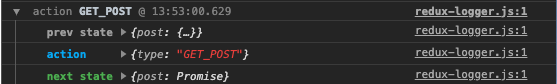

# React로 Redux 비동기를 동작시켜보자

새롭게 공동 창업을 시작한 이후로 개인적으로 공부하고 글 쓸 시간이 확 줄어서 계획했던 글을 쓰지를 못 하고 있다 (거창하게 JS에서 공부하기 어려웠던 부분들을 정리해보겠다고 목차만 써놨는데 공부만 하고 정리하지 못 하고 있다). 연휴를 맞아서 개인적인 시간이 남기도 하고 새로 빌딩 중인 앱에 리덕스를 붙여야 하는 상황이라 개별적으로 평소에 리덕스의 비동기를 위한 미들웨어를 공부해보려고 한다. 사실 비동기 처리를 위해서 미들웨어를 사용해야 한다는 것에 대해서 잘 이해를 못 했다. 자바스크립트는 기본적으로 비동기 처리가 간단하게 되는데 왜 비동기를 위한 미들웨어가 필요할까? 라는 생각이 들고 지금 글을 쓰는 과정에서도 그 부분을 해결하기 위한 관점이 가장 클 것 같다. 우선 프로젝트는 `CRA`를 통해 구성했다. 그리고 필요한 패키지들을 설치했다.

```bash
npx create-react-app . --typescript

yarn add react-redux redux axios styled-components
yarn add @types/{styled-components,react-redux} -D # redux는 타입스크립트로 구성되어 있어서 설치할 필요가 없다고 함
```

## Redux에 대해서

리덕스는 너무나 유명한 상태 관리 시스템이다. 상태 관리는 React 프로젝트에서 너무나 필요한 기능이지만, 리덕스라는 개념은 정확하게는 리액트에서만 통용되는 것은 아니고, 그냥 말 그대로 상태를 관리하도록 돕는 일종의 시스템이다. [리덕스를 소개하는 페이지](https://redux.js.org)에서는 리덕스의 중요 원칙을 세 가지로 정리했다.

1. Single source of truth
   애플리케이션의 모든 상태는 하나의 스토어 안에 하나의 객체 트리 구조로 저장된다는 의미인데. 디버깅이 쉽고, 여러 곳에서 상태를 관리하지 않아도 된다는 것을 의미한다.

2. State is read-only
   애플리케이션의 상태는 항상 읽기 전용이고, 상태를 객체를 직접 조작함으로써 변경할 수 없다는 것을 의미한다. 상태를 변화시키기 위해서는 어떤 일이 발생할지 기술된 `Action`을 전달하는 것이 유일한 방법이 되어야 한다는 것이다.

3. Changes are made with pure functions
   `Action`을 통해 생기는 변화는 순수 함수를 통해서 이루어져야 한다는 의미이다. 이때 변화를 만드는 함수를 리듀서라고 하는데 이 리듀서는 이전 `state`를 받고 이전 `state`와는 독립적인 새로운 `state`를 반환해야 한다.

이 세 가지가 리덕스의 원칙이고, 이 원칙 마지막에 리덕스를 모두 알게 된 것이라고 말한다(?). 사용하다 보면 대충 알게 되지만 엄밀히 틀린 말은 아니라고 생각 되었다. 우리는 상태(`state`)가 있고, 이를 특정 `action`을 `dispatcher`에게 전달 함으로써 다음 상태로 변경시키는 과정을 리듀서로 적용해서 실제로 상태를 변경시키는 것을 리덕스가 하는 역할이라고 볼 수 있다. 풀어서 쓰다 보니 오히려 비문이 되긴 했지만, 간단한 원리.

```
1.
[STATE]

2.
dispatch(action) -> reducer(action, STATE) => NEWSTATE -> STATE = NEWSTATE
```

### Action

`Action`은 애플리케이션에서 스토어로 보내는 데이터 묶음이다. 위 도식에서 볼 수 있듯, `dispatch({type: GET_POST})` 처럼 `dispatch`를 통해 전달할 수 있다. 타입 말고 다른 데이터 들도 넘길 수 있다. 타입은 반드시 필요하고, 나머지는 마음대로지만, 넘겨야 하는 데이터가 적을 수록 좋다고 한다.

### Action Creator

`Action Creator`는 이름 그대로 액션을 만들어내는 주체이다. 만들어내는 행위는 당연 함수가 하겠지. `Action Creator`의 존재는 사실 함수형 프로그래밍의 원칙을 위해 만들어진 개념이 아닌가 싶었다. 대충 예시는 다음과 같다.

```typescript
function getPost(id: number) {
  return {
    type: GET_POST,
    id
  };
}

dispatch(getPost(id));
```

### Reducer

리듀서는 액션에 따라서 스토어의 상태를 변화시키는 함수이다. 이전 상태와 `action`을 받아서 새로운 `state`를 내보내기만 하면 역할은 완료이다. 여러 `action`들이 있기 때문에 보통 리듀서는 `switch` 문으로 작성되게 된다.

### Reducer function

이 부분은 사실 분리 하는 사람도 있고 아닌 사람도 있겠지만, 함수의 Depth가 깊어지는 것을 막고 싶기 때문에 추가한다. 쉽게 말해서 리듀서가 어떻게 동작할지를 따로 분리시키는 것이다.

```typescript
...
export default function reducer(state = initalState, action = {}) {
  switch (action.type) {
    case CREATE_POST:
      // 이부분에 해당하는 걸 함수로 나눠준다.
      applyCreatePost(state, action)
      break;
      ...
    default: return state;
  }
}
...

const applyCreatePost = (state, action) => {
  ...
}
```

### Store

스토어에서는 애플리케이션의 상태를 저장하고, `getState()`를 통해서 상태에 접근하게 하고, `dispatch(aciton)`을 통해 상태를 수정할 수 있게 하고, `subscribe(listener)`를 통해 리스너를 등록한다. `createStore()`를 통해서 스토어를 만들 수 있다. `createStore(app, initialState)` 같은 형태로 사용된다.

### react-redux

리액트의 경우에 스토어를 모든 컴포넌트에서 불러올 수 있도록 하기 위해서 `Provider`를 제공해주는 `react-redux` 패키지가 존재한다. 아래와 같이 hoc 패턴으로 스토어를 제공한다.

```tsx
...
import {Provider} from 'react-redux';

const App: React.FC = () => {
  return (
    <Provider store={store}>
      <PostScreen />
    </Provider>
  );
};
```

그리고 컴포넌트의 `props`에 `store`와 `dispatch` 함수를 넣기 위해서 `connect` 함수를 제공한다.

## Redux ducks 패턴

리덕스 앱을 구축하는 과정에서, 리덕스의 여러가지 부분을 파일로 분할하게 되면 여러 파일을 수정해야 하는 경우가 생기기 때문에 그러한 경우를 방지하기 위해 단순하게 하나의 파일에 reducer가 만들어지도록 하는 패턴이다. 규칙은 다음과 같다.

하나의 모듈은

1. **항상** `reducer`라는 이름의 함수를 `export default` 해야 한다.
2. **항상** 모듈의 `actionCreator`를 함수 형태로 `export` 해야 한다.
3. **항상** `npm-module-or-app/reducer/ACTION_TYPE` 형태의 `actionType`을 가져와야 한다.
4. **어쩌면** `actionType`을 `UPPER_SNAKE_CASE`로 `export` 할 수 있다. 만약 외부 `reducer`가 해당 `action`이 발생하는지를 기다리거나, 재사용할 수 있는 라이브러리로 퍼블리싱 할 경우에

간단하게 비동기를 진행하기 전까지의 원칙과 사용 방법 등을 간단하게 정리했다. 그러면 리덕스를 붙이기 전 리액트 앱을 만들고, 리덕스를 붙이는 방식으로 바꾼 다음 비동기를 작성해보고 어떤 문제가 있고, 이 문제를 해결하기 위해서 가장 유명하다는 `react-thunk` 또는 `react-saga`를 도입해보자

## 리덕스를 붙이기 전

여기서 당시 [코드](https://github.com/changhoi/redux-async-demo/tree/8865f428bc77232c46061dd6efb828a2c28ae269)를 확인할 수 있다.

`screens/PostScreen`을 Container, Presenter 구조로 나눠서 api로 데이터를 받아오는 로직을 `PostScreen.tsx`에 담고, CSS와 관련된 컴포넌트들을 `Presenter.tsx`에 담도록 했다.

```tsx
import React from "react";
import styled from "styled-components";

interface IProps {
  postList: Array<{ title: string; body: string; id: number }>;
}

const Presenter: React.FC<IProps> = props => {
  const { postList } = props;
  return (
    <Wrapper>
      <Container>
        {postList?.length &&
          postList.map((post, index) => (
            <PostDiv key={index}>
              <div>{post.title}</div>
              <div>{post.body}</div>
            </PostDiv>
          ))}
        <PostDiv></PostDiv>
      </Container>
    </Wrapper>
  );
};

export default Presenter;

const Wrapper = styled.div`
  width: 100%;
  display: flex;
  justify-content: center;
`;

const Container = styled.div`
  width: 70%;
  display: flex;
  flex-direction: column;
  justify-content: center;
`;

const PostDiv = styled.div`
  width: 90%;
  height: 10rem;
  border: 1px solid black;
  border-radius: 5px;
  margin: 1rem 0;
  padding: 0.25rem;
`;
```

```tsx
// src/screen/PostScreen.tsx
import React, { useState, useEffect } from "react";
import Presenter from "./Presenter";
import Axios from "axios";
import { ENDPOINTS } from "../../../constants";

const PostScreen: React.FC = props => {
  const [postList, setPostList] = useState([]);

  const getPost = async () => {
    const { data: postList } = await Axios.get(ENDPOINTS.GET_POSTS, {
      baseURL: ENDPOINTS.BASE_URL
    });
    setPostList(postList);
  };

  useEffect(() => {
    getPost();
  });
  return <Presenter postList={postList} />;
};

export default PostScreen;
```

## 리덕스 구성하기

이 [링크](https://github.com/changhoi/redux-async-demo/tree/4f145bca9bf90cab4500177185d60c2780d9cd40)에서 이 챕터까지 진행한 코드를 확인할 수 있다.

위와 같은 상황에서 글 쓰기와 불러오기를 `useEffect`에 들어가는 `getPost`와 같은 형태가 아니라 모듀 리덕스를 통해 동작하도록 바꿔보자.
`src/redux/configureStore.ts`를 만들고 아래 폴더에 `src/redux/modules/`를 만들어서 아래 리덕스 모듈들을 ducks 형태로 만들어서 전체적인 리덕스를 구성해보려고 한다.
`src/redux/modules/post.ts`를 만들고 ducks 형태로 리덕스 모듈을 구성하자.

```typescript
// src/redux/modules.post.ts
// imports
import axios from "axios";
import { ENDPOINTS } from "../../../constants";

// Action Types

export const GET_POST = "GET_POST";
export const CREATE_POST = "CREATE_POST";

// Action Creators

export function getPost() {
  return { type: GET_POST };
}

export function createPost(title: string, content: string) {
  return { type: CREATE_POST, title, content };
}

// Initial State

interface IPost {
  title: string;
  body: string;
}

export const initialState: { postList: Array<IPost>; newPost?: IPost } = {
  postList: []
};

// Reducer
function reducer(state = initialState, action: any) {
  switch (action.type) {
    case GET_POST:
      return applyGetPost();
    case CREATE_POST:
      const { title, body } = action as IPost & { type: string };
      return applyCreatePost(state, title, body);
    default:
      return state;
  }
}

// Reducer Functions

const applyGetPost = async () => {
  const postList = await axios.get(ENDPOINTS.GET_POSTS, {
    baseURL: ENDPOINTS.BASE_URL
  });
  return {
    postList
  };
};

const applyCreatePost = async (state: any, title: string, body: string) => {
  const newPost = await axios.post(ENDPOINTS.GET_POSTS, {
    baseURL: ENDPOINTS.BASE_URL,
    body: { title, body }
  });
  return { ...state, newPost };
};

// Default Reducer export

export default reducer;
```

`useEffect`에서 했던 것을 비동기 망한 예시를 위해 모두 `reducer`로 작성했다. 작성하면서 비동기로 하면 왜 안될 것 같은지를 깨닫게 되었지만 일단 진행해보자. 아래는 `configureStore`파일이고, 가장 상위 App에 store를 보내는 것으로 수정했다.

```typescript
// src/redux/configureStore.ts
import { combineReducers } from "redux";

import post from "./modules/post";

export default combineReducers({ post });
```

```tsx
// src/App.tsx
...

const store = createStore(rootReducer, applyMiddleware(logger)); // 두 번째 인수는 초기 상태를 지정할 수 있음

const App: React.FC = () => {
  return (
    <Provider store={store}>
      <PostScreen />
    </Provider>
  );
};
```

그러고 나서 실제 스크린에서 사용할 수 있게 props로 dispatch 하는 함수와 store의 state를 넘겨주었다.

```tsx
import PostScreen from "./PostScreen";
import { connect } from "react-redux";
import { getPost } from "../../redux/modules/post";

const mapStateToProps = (state: any, ownProps: any) => {
  return {
    ...ownProps,
    ...state
  };
};

const mapDispatchToProps = (dispatch: any, ownProps: any) => {
  return {
    ...ownProps,
    getPost: async () => dispatch(getPost())
  };
};

export default connect(mapStateToProps, mapDispatchToProps)(PostScreen);
```

컨테이너에 해당하는 `PostScreen.tsx`는 아래와 같이 수정했다. `useEffect`를 없애고 클릭하면 스토어가 업데이트 되도록 변경한 모습이다.

```tsx
import React from "react";
import Presenter from "./Presenter";

interface IProps {
  getPost: Function;
  postList: Array<any>;
}

const PostScreen: React.FC = props => {
  const { postList, getPost } = props as IProps;

  // const getPost = async () => {
  //   const { data: postList } = await Axios.get(ENDPOINTS.GET_POSTS, {
  //     baseURL: ENDPOINTS.BASE_URL
  //   });
  //   setPostList(postList);
  // };

  const onClick = async () => {
    await getPost();
  };

  return <Presenter onClick={onClick} postList={postList} />;
};

export default PostScreen;
```

결과적으로 가져오기 버튼을 클릭하면 스토어의 모습이 다음과 같이 변한다.



스토어의 객체가 `Promise`가 된 것이다. 이것을 그냥 해결해 보려고 recursive 하게 `async` `await`으로 변경도 해봤지만 바뀌지 않았다. 아무튼 이러한 문제가 있다는 것을 알게 된 시도였다.

## Redux thunk

이 [링크](https://github.com/changhoi/redux-async-demo/tree/2f323144d76c20fc019c39dab37b6e8323d6c879)에서 `thunk`로 문제를 해결한 다음 코드를 확인할 수 있다.

일단 미들웨어를 설치해보자

```bash
yarn add redux-thunk
```

그러면 이제 `saga`, `thunk`를 적용해보도록 하자. 먼저 `redux` 공식 문서에서 소개하고 있는 `redux-thunk`를 먼저 도입해보자. `Action Creator` 부분도 fetching 중인지 나타내는 상태까지 관리하도록 변경했다 (공식 문서에 있는 예시에 나온 그대로) 변경된 내용은 아래와 같다.

먼저 `configureStore.ts`에 `store`를 만들어서 `export default` 변경해주었다. 하는 방식으로 변경했다. 미들웨어 설정도 붙이게 되면 `App.tsx`에다가 코드를 쓰는 것보다는 여기서 코드를 완성해서 내보내는 게 더 맞는 것 같다고 생각했다.

```typescript
import { createStore, applyMiddleware, combineReducers } from "redux";
import logger from "redux-logger";
import thunk from "redux-thunk";

import post from "./modules/post";

const rootReducer = combineReducers({ post });

export default createStore(rootReducer, applyMiddleware(thunk, logger)); // 두 번째 인수는 초기 상태를 지정할 수 있음
```

그리고 나서 reducer를 많이 변경 했는데, `FETCH_POST_START`와 `FETCH_POST_END`를 만들었고, `getPost`는 그냥 네트워킹 로직을 처리하는 함수가 되었다.

```typescript
...
// Action Creators

export function getPost() {
  return async (dispatch: Function) => {
    dispatch(startPost());
    const { data: postList } = await axios.get(ENDPOINTS.GET_POSTS, {
      baseURL: ENDPOINTS.BASE_URL
    });
    return dispatch(endPost(postList));
  };
}

export function startPost() {
  return { type: FETCH_POST_START };
}

export function endPost(postList: Array<any>) {
  return { type: FETCH_POST_END, payload: { postList } };
}

...

function reducer(state = initialState, action: any) {
  switch (action.type) {
    case FETCH_POST_END:
      const { postList } = action.payload;
      return applyFetchPostEnd(state, postList);

    case FETCH_POST_START:
      return applyFetchPostStart(state);
    default:
      return state;
  }
}

// Reducer Functions

const applyFetchPostStart = (state: any) => {
  return { ...state, isFetching: true };
};

const applyFetchPostEnd = (state: any, postList: Array<any>) => {
  return {
    ...state,
    postList,
    isFetching: false
  };
};
```

작성하는 과정에서 `thunk`가 어떻게 구성되어 있는지 확인하지는 않았는데 시행 착오를 겪고 나니 대충 감이 왔다. 의사코드로 나타내면 아마도 정말 간단하게도 이런 구조가 아닐까 싶다.

```typescript
const thunk = (dispatch, getState, action) => {
  if (typeof action === "function") {
    return action(dispatch, getState);
  }

  return action;
};
```

물론 미들웨어가 다음 단계로 넘어가는 구조가 어떻게 되어 있는지는 확인하지 못 해서 정교한 구조는 아니겠지만, `actionCreator`로 `dispatch(actionCreator())`가 되었을 때를 판단하게 되는 것 같다.

> 궁금해서 까봤는데 코드가 아주 비슷하긴 하다. 실제로 14줄 짜리 코드라 더 놀라운데 궁금한 사람은 이 [링크](https://github.com/reduxjs/redux-thunk/blob/master/src/index.js)에서 확인해보자.

## Redux-saga

[여기](https://github.com/changhoi/redux-async-demo/tree/36a5a3988b019f6cf8d81506fa74f298a78953cd)서 마지막으로 해결한 상태의 코드를 확인해볼 수 있다.

일단 설치먼저 해두고 문서를 또 읽어보기로 했다.

```bash
yarn add redux-saga
```

사가 문서를 읽어보면 사이드 이펙트를 쉽게 관리해준다고 표현되어있다. 특히 여러 글에서 실패하는 경우 마치 트랜젝션이 가능한 것처럼 표현하는 글을 한 두 번 본 기억이 있다. 사가는 리덕스의 함수형 프로그래밍적인 특성을 그대로 유지하고 (순수 함수, 상태 변경을 action으로만 등), 비동기적인 로직을 사가에서 맡아서 처리하도록 한다. 여기서 맡아서 처리하도록 한다를 `Generator`를 사용하도록 만들어져있다. 기본적으로 `Generator`는 실행 맥락을 함수 중간 중간 떠넘길 수 있도록 구성할 수 있기 때문에 이러한 투트랙 느낌의 비동기 처리가 가능한 것 같다. 아주 Advanced한 경우는 아직 확인해보지 못 했지만, 위와 같은 간단한 예시를 구성하는 것 자체는 크게 어렵지 않았다. 우선 `thunk` 미들웨어를 `saga` 미들웨어로 교체했다. (기존에 `src/redux/modules/post` 아래를 `thunkReducer.ts`, `sagaReducer.ts`로 나눴다.)

```ts
// src/redux/configureStore.ts

import { createStore, applyMiddleware, combineReducers } from "redux";
import logger from "redux-logger";
import createSagaMiddleware from "redux-saga";
import post, { rootSaga } from "./modules/post/sagaReducer";

const sagaMiddleware = createSagaMiddleware();

const rootReducer = combineReducers({ post });

export default createStore(
  rootReducer,
  applyMiddleware(sagaMiddleware, logger)
); // 두 번째 인수는 초기 상태를 지정할 수 있음

sagaMiddleware.run(rootSaga);
```

`sagaReducer.ts`는 다음과 같이 변경되었다. `getPost` Action Creator를 붙여서 타입과 페이로드만 넘기는 형태로 바뀌었다. (기존 `thunk` 에서는 `api`를 동작시키는 함수를 호출해야 했음, 그리고 에러 처리를 위해 FAIL이 추가됨) 그러면서 `saga`에게는 어떤 Action Type인지에 따라서 비동기 처리를 할 것인지 말 것인지를 listen 하고 있는 형태인 것 같다.

```ts
import { call, put, takeEvery, all } from "redux-saga/effects";
import axios from "axios";
import { ENDPOINTS } from "../../../constants";

// Action Types

export const FETCH_POST_FAIL = "FETCH_POST_FAIL";
export const FETCH_POST_START = "FETCH_POST_START";
export const FETCH_POST_END = "FETCH_POST_END";
export const FETCHING_POST = "FETCHING_POST";

// Saga

const fetchPost = () =>
  axios.get(ENDPOINTS.GET_POSTS, { baseURL: ENDPOINTS.BASE_URL });

function* fetchPostList() {
  try {
    const { data: postList } = yield call(fetchPost);
    yield put({ type: FETCH_POST_END, payload: { postList } });
  } catch (e) {
    yield put({ type: FETCH_POST_FAIL, payload: e });
  }
}

function* postSaga() {
  yield takeEvery(FETCHING_POST, fetchPostList);
}

export function* rootSaga() {
  yield all([postSaga()]);
}

// Action Creators

export function getPost() {
  return { type: FETCHING_POST };
}

export function startPost() {
  return { type: FETCH_POST_START };
}

export function endPost(postList: Array<any>) {
  return { type: FETCH_POST_END, payload: { postList } };
}

// Initial State

interface IPost {
  title: string;
  body: string;
}

export const initialState: { postList: Array<IPost>; newPost?: IPost } = {
  postList: []
};

// Reducer
function reducer(state = initialState, action: any) {
  switch (action.type) {
    case FETCH_POST_END:
      const { postList } = action.payload;
      return applyFetchPostEnd(state, postList);

    case FETCH_POST_START:
      return applyFetchPostStart(state);

    case FETCH_POST_FAIL:
      return applyFetchPostFail(state, action.payload);
    default:
      return state;
  }
}

// Reducer Functions

const applyFetchPostStart = (state: any) => {
  return { ...state, isFetching: true };
};

const applyFetchPostEnd = (state: any, postList: Array<any>) => {
  return {
    ...state,
    postList,
    isFetching: false
  };
};

const applyFetchPostFail = (state: any, payload: any) => {
  const error = { title: payload.message, body: JSON.stringify(payload.stack) };
  state.postList.push(error);
  return {
    ...state
  };
};

// Default Reducer export

export default reducer;
```

현재 프로젝트는 `src/screens/PostScreen/index.tsx`에서 `import { getPost } from "../../redux/modules/post/thunkReducer";` 이 부분만 `sagaReducer`로 바꿔주면 사가로 동작하고 `thunkReducer`로 두면 `thunk`로 동작하게 구성되어져 있다. 최종적인 프로젝트는 이 [링크](https://github.com/changhoi/redux-async-demo)에서 확인할 수 있다.

## 후기

결과적으로 프로덕트에는 `saga`를 공부해서 붙이기로 결정했다. 간단하게만 경험했지만, `saga`는 `thunk`의 +a를 많이 제공하고 있다. 단순히 `thunk`가 하는 일을 `takeEvery();`와 `call(API)` 정도로 모두 커버 가능 하면서도, 강력한 기능에 대한 예시들을 공식 문서나 advanced 자료에서 쉽게 찾아볼 수 있다는 점, 디테일한 `Helper function` 등 선택하는 것에 큰 매력을 주기도 했고, `actionCreator`를 단순하게 유지할 수 있다는 것과 동시에 재사용이 `thunk`보다는 쉽다는 점 (그냥 리슨하고 있는 제네레이터 함수일 뿐이기 때문에, 종속적이지 않게 짤 수 있다고 생각됨) 등... 두서 없이 생각해내다 보니까 계속 나오는데 강력한 기능을 경험한 다음 `saga`에 대한 글을 한 번 더 쓸 수 있으면 좋겠다.

## Reference

- https://lunit.gitbook.io/redux-in-korean/advanced/asyncactions
- https://mskims.github.io/redux-saga-in-korean/introduction/BeginnerTutorial.html
- https://github.com/reactkr/learn-react-in-korean/blob/master/translated/deal-with-async-process-by-redux-saga.md
- https://redux-advanced.vlpt.us/2/05.html
- https://ko.javascript.info/generators
- https://ko.javascript.info/async-iterators-generators
